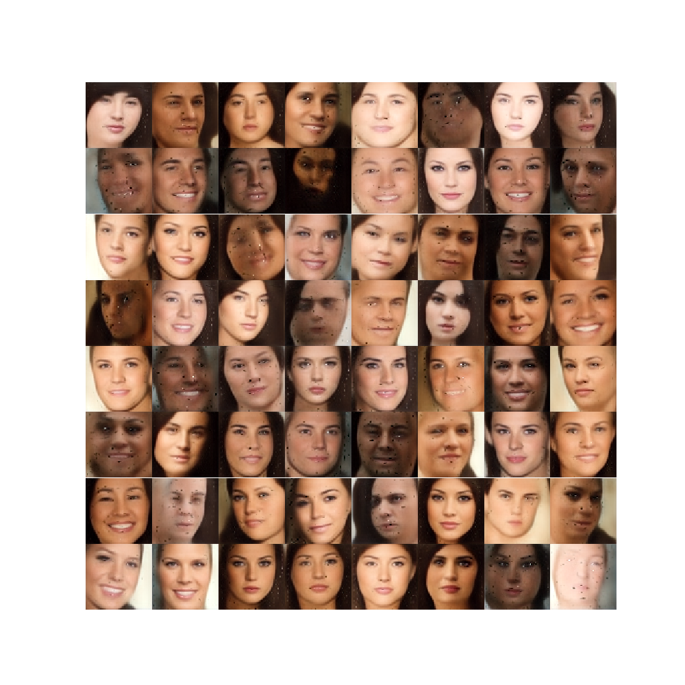
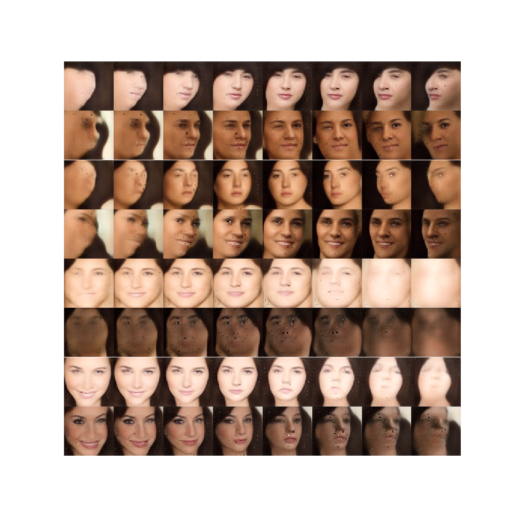

# Pose-based-Conditional-BEGAN
A pytorch implementation of paper "GAN-Based Realistic Face Pose Synthesis with Continuous Latent Code", https://aaai.org/ocs/index.php/FLAIRS/FLAIRS18/paper/view/17643

It uses modified BEGAN to generate faces conditioned by face poses.
## Requirements
### Enviroment
- Python 3.6
- PyTorch 1.0.0

And common libraries such as numpy and matplotlib.

### Dataset

Download **in the wild** [CelebA](http://mmlab.ie.cuhk.edu.hk/projects/CelebA.html) dataset and uncompressed it to have a directory structure like below.
```
data_dir
├── img_celeba
|   ├── 000001.jpg
|   ├── 000002.jpg
|   └── ...
└── Anno
    ├── list_bbox_celeba.txt
    └── list_landmarks_align_celeba.txt
```

## Usage
### Train
To train a model use default parameters:
```
$ python train.py --data_dir path/to/data_dir
```
### Inference
A pretrained model of generator is included in checkpoints dir, to use it generate faces:
```
$ python inference.py --checkpoint checkpoints/checkpoint_final_G
```

## Results
- Zero pose faces generated randomly.

- Evenly spaced faces, fixed noise z for each row.
For first 4 rows, the yaw varies evenly from -90 to 90.
For next 2 rows, the roll varies evenly from -90 to 90.
For last 2 rows, the pitch varies evenly from -90 to 90.


## Note
- I didn't try image size with 128, nor do I have enough resources to train one. It should be easy to modify the code to train a 128x128 model, just be careful with the draw debug image part, there may be some hard-code for image size 64.
- In the paper I got, the learning rate was set to 8e-4, I failed to find converge with that learning rate. The results are given by a learning rate of 8e-5 and it worked like a charm.
- In the paper, the auther flip the images and add it to dataset. While I just filp at random, and increase training epoch from 20 to 40.

## Author
Li Yizhuo / [@liyz15](https://github.com/liyz15)
